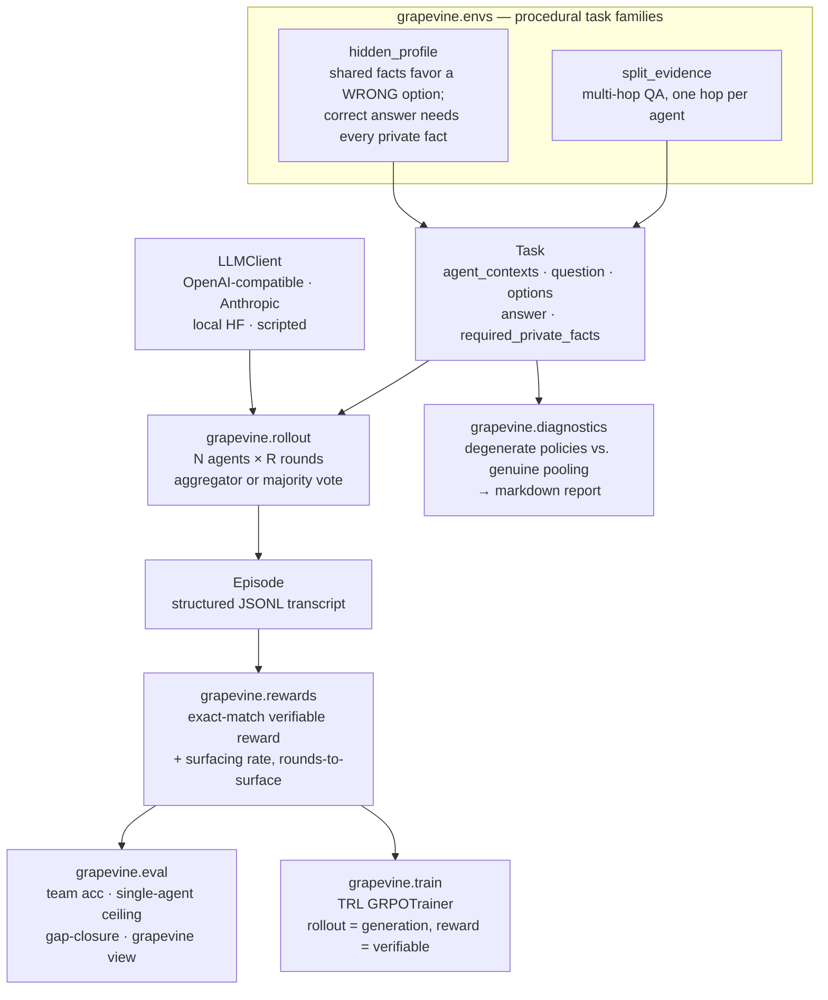

# Grapevine

**A research toolkit for studying — and training against — the Hidden Profile failure in multi-agent LLM teams.**

[](https://github.com/Samarth-Hiremath1/Grapevine/actions/workflows/ci.yml)
[](LICENSE)
[](https://www.python.org/downloads/)

---

## The problem

When information is **distributed** across agents, LLM teams collapse.

HiddenBench ([arXiv:2505.11556](https://arxiv.org/abs/2505.11556)) adapts the *Hidden Profile*
paradigm from social psychology (Stasser & Titus, 1985) to multi-agent LLMs and reports the headline
result: agent teams reach roughly **30%** accuracy on tasks where a **single agent given the full
context scores about 81%**. Splitting the *same* information across a team destroys performance.

The failure is specific, and it is not a reasoning failure. Agents combine information fine **once it
is on the table**. What they fail to do is **ask** for what they are missing. They discuss the common
ground everyone already shares and never surface the private facts that would change the answer.
That is exactly the dynamic hidden-profile tasks are designed to expose.

Grapevine makes that failure **measurable, reproducible, and trainable**:

1. **Procedurally generated environments** with verifiable rewards.
2. A **multi-agent rollout engine** (async, provider-agnostic, cost-tracked).
3. **Evaluation metrics + transcript visualization** showing *which* facts surfaced and *when*.
4. A **GRPO training pipeline** to optimize communication against the verifiable reward.
5. **Reward-hacking diagnostics** checking the reward can't be earned without genuine pooling.

## Architecture



The key contract: **no single agent context is sufficient**. The answer is only derivable once every
fact in `required_private_facts` has been surfaced, which is what makes the exact-match reward a
genuine signal for information pooling rather than for guessing.

## Quickstart

Grapevine uses [uv](https://docs.astral.sh/uv/) and Python 3.11.

```bash
git clone https://github.com/Samarth-Hiremath1/Grapevine.git
cd Grapevine
uv venv --python 3.11
uv pip install -e ".[dev]"
```

Generate tasks and inspect one:

```bash
uv run grapevine gen hidden_profile --n 3
```

Check that the reward cannot be gamed by shortcuts that skip information sharing:

```bash
uv run grapevine diagnose hidden_profile --n 300 --out report.md
```

Run the baseline experiment (single agent vs. distributed team). Without an API key it generates the
tasks and prints the exact command instead of failing:

```bash
export OPENAI_API_KEY=...      # optional
uv run python experiments/baseline/run_baseline.py --model gpt-4o-mini --k 30
```

Pretty-print a transcript, with each required private fact color-coded by whether and when it
surfaced:

```bash
uv run grapevine view experiments/baseline/transcripts.jsonl
```

Run the GRPO loop (2 steps on CPU — a wiring smoke test, not a training run):

```bash
uv pip install -e ".[train]"
uv run python -m grapevine.train.grpo configs/smoke_cpu.yaml
```

## Components

| Module | What it does |
| --- | --- |
| `grapevine/envs/` | `hidden_profile` and `split_evidence` generators behind a common `Env` interface. Deterministic under seed; ship ground-truth answers and the minimal fact set needed. |
| `grapevine/rollout/` | Async N-agent × R-round engine. Provider-agnostic client with retry/backoff and per-run cost tracking. Full structured JSONL transcripts. |
| `grapevine/rewards/` | Exact-match verifiable reward, plus private-fact surfacing rate and rounds-to-surface computed from transcripts. |
| `grapevine/eval/` | Team accuracy, single-agent full-context ceiling, chance-relative gap-closure, surfacing rate, and the `grapevine view` transcript viewer. |
| `grapevine/diagnostics/` | Battery of degenerate policies (always-A, random, no-discussion, copy-teammate, longest-message) compared to genuine pooling with a two-proportion z-test. |
| `grapevine/train/` | TRL `GRPOTrainer` wiring: generated agent messages are scored by running the rest of a real multi-agent rollout and applying the verifiable reward. |

### On the hidden-profile construction

The generator guarantees — and the test suite verifies programmatically for every config — that:

1. **Shared facts favor a wrong option.** The decoy holds a strict lead on shared information alone.
2. **The correct option wins only with full pooling.** It is the unique winner over all facts.
3. **Every required private fact is necessary.** Dropping any single one removes the correct
   option's lead, so `required_private_facts` is genuinely minimal.

### On the reward-hacking diagnostics

Every degenerate policy in the battery is a **non-pooling shortcut**: it may use position, chance, or
a single agent's own context, but never information pooled across agents. That restriction is the
point — a policy allowed to read every context is already doing the thing the reward is meant to
incentivize. Both families currently pass: no degenerate policy comes statistically close to genuine
pooling.

## Status

**v0** — environments, rollout engine, metrics, diagnostics, baseline experiment, and a GRPO loop
that is **wired and smoke-tested** (2 steps on CPU in CI, proving generation → rollout → verifiable
reward → optimizer step executes end to end).

**In progress** — full GRPO training runs and transfer evaluation.

This repository contains **no fabricated results**. `experiments/baseline/results.md` is an explicit
placeholder until the experiment is actually run with an API key, and no training numbers appear
anywhere, because no full training run has been done yet. The CPU smoke test deliberately asserts
only that the loop executes — not that the model learns.

Known scope limits of v0, stated plainly:

- GRPO optimizes **agent 0's opening turn**; the other agents and the aggregator are played by an
  auxiliary client. Training all agents jointly is future work.
- The surfacing metric is a fuzzy string-match proxy targeting verbatim-to-near-verbatim sharing
  (which the agent prompt explicitly encourages), not a full entailment check.

The training backend choice is documented in
[`grapevine/train/nemo_rl_notes.md`](grapevine/train/nemo_rl_notes.md): NVIDIA NeMo-RL was actually
installed and attempted, and the notes record why v0 stays on TRL (NeMo-RL has no CPU generation
backend, so it cannot run the CI smoke test) along with the friction encountered.

## Roadmap

The research question this is built to answer:

> **Does RL-trained communication transfer to held-out task families?** If a model is trained with
> GRPO to solicit hidden information on `hidden_profile`, does the learned *asking* behavior
> generalize to `split_evidence` and beyond — or does it overfit to the surface form of the training
> family?

Planned work, roughly in order:

- [ ] Full GRPO training runs on `Qwen2.5-0.5B-Instruct` (T4 / A100), with learning curves.
- [ ] **Transfer evaluation**: train on one family, evaluate held out on the other.
- [ ] Train all agents jointly rather than agent 0 alone.
- [ ] Scale the policy and vary team size / round budget.
- [ ] Additional task families (negotiation, distributed constraint satisfaction).
- [ ] Reward-shaping ablations: does adding a surfacing bonus help, or does it get hacked?

## Development

```bash
uv pip install -e ".[dev]"
ruff check grapevine tests experiments
mypy
pytest -q                  # add -m "not slow" to skip the GRPO smoke test
```

CI runs lint, type checking, and the full test suite (including the CPU GRPO smoke test) on every
push and pull request.

## Citation

The failure mode this toolkit targets is HiddenBench, **arXiv:2505.11556**
(<https://arxiv.org/abs/2505.11556>) — please pull the authoritative title and author list from the
arXiv listing when citing it formally:

```bibtex
@misc{hiddenbench,
  howpublished = {arXiv preprint arXiv:2505.11556},
  year         = {2025},
  url          = {https://arxiv.org/abs/2505.11556}
}
```

The original paradigm: Stasser, G., & Titus, W. (1985). *Pooling of unshared information in group
decision making: Biased information sampling during discussion.* Journal of Personality and Social
Psychology, 48(6), 1467–1478.

## License

MIT — see [LICENSE](LICENSE).
