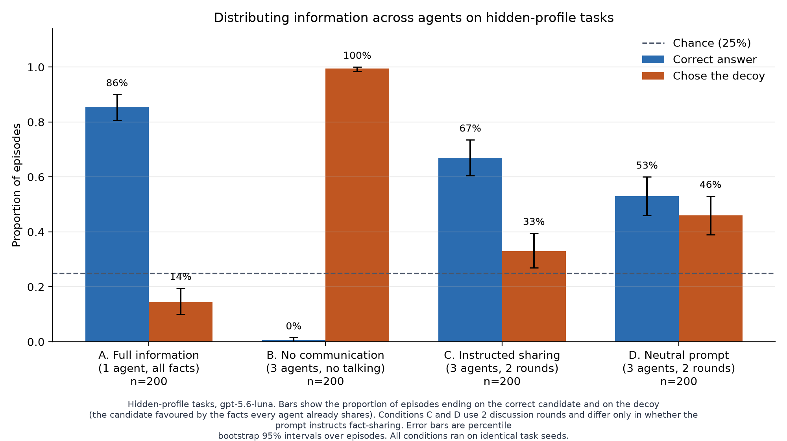

# Grapevine

Grapevine is a research toolkit for studying why LLM agent teams fail when the
information needed for a decision is split across them. It generates
hidden-profile tasks procedurally, runs multi-agent rollouts against them, and
scores the outcome against ground truth rather than a judge model. The question
it exists to answer is which part of coordination actually breaks: getting facts
into the conversation, or using them once they are there.

[](https://github.com/Samarth-Hiremath1/Grapevine/actions/workflows/ci.yml)
[](LICENSE)
[](https://www.python.org/downloads/)

## Why

In a hidden-profile task each member of a group holds a different slice of the
evidence. The facts everyone already shares point at one candidate; the facts
held privately point at a better one. Groups reliably choose the first, because
discussion tends to rehearse common ground instead of pooling what is unique.
The paradigm comes from Stasser and Titus (1985).

Prior work applying this to LLM teams, notably HiddenBench
([arXiv:2505.11556](https://arxiv.org/abs/2505.11556)), reports agent groups
performing substantially worse than a single agent holding all the same
information. **Those are that paper's numbers, not results produced by this
repository.** Grapevine builds its own tasks and measures its own conditions;
the only thing carried over is the qualitative motivation.

## Main result

Four conditions, 200 procedurally generated tasks each, identical task seeds,
`gpt-5.6-luna`.



| Condition | N | Accuracy | 95% CI | Decoy rate | Surfacing |
|---|---:|---:|---|---:|---:|
| A. Full information, 1 agent | 200 | 85.5% | [80.5, 90.0] | 14.5% | n/a |
| B. Distributed, no communication | 200 | 0.5% | [0.0, 1.5] | 99.5% | n/a |
| C. Distributed, instructed sharing, 2 rounds | 200 | 67.0% | [60.5, 73.5] | 33.0% | 100.0% |
| D. Distributed, neutral prompt, 2 rounds | 200 | 53.0% | [46.0, 60.0] | 46.0% | 82.7% |

Chance is 25%. Intervals are percentile bootstrap over episodes.

Three things came out of it:

Splitting the information across three agents dropped accuracy from 85.5% to
0.5%, well below chance, because the shared facts are built to favour a specific
wrong candidate and agents reasoning from what they can see pick it. Every wrong
answer in all 800 episodes was that candidate.

Discussion recovered most of the loss (+52.5 points over silence), and telling
agents explicitly to share and ask added a further +14.0 points
[+6.0, +22.5]. Condition C is therefore described as *instructed* pooling
wherever it appears; the recovery is not a property of discussion alone.

The part that surprised us: in condition C every required private fact was
surfaced in all 200 episodes, and accuracy still sat 18.5 points below the
single-agent ceiling. Elicitation was fully solved and the gap did not close.
The bottleneck is weighting the evidence once it has been pooled, not getting it
onto the table. `docs/results.md` has the transcript.

## Architecture

- **Environment** (`grapevine/envs/`) generates hidden-profile tasks from a
  seed. Shared facts give a decoy a strict lead; private facts, split across
  agents, all support the correct answer, with a final margin of exactly one so
  every private fact is load-bearing. The test suite asserts these properties
  for every configuration used.
- **Rollout engine** (`grapevine/rollout/`) runs N agents over R rounds against
  a provider-agnostic async client with retry and per-episode cost tracking.
  Every episode is written as one JSONL line including the full transcript.
- **Rewards** (`grapevine/rewards/`) score exact match against the gold answer
  and compute how much of the required private information reached the
  conversation.
- **Evaluation** (`grapevine/eval/`, `grapevine/experiments/`) aggregates
  accuracy, decoy rate, surfacing, tie and parse-failure counts with bootstrap
  intervals, and draws the figure.
- **Training** (`grapevine/train/`) wires the environments into a TRL GRPO loop.
  This is scaffolding: it is smoke-tested on CPU in CI, and no training run has
  been done. See Limitations.

## Quick start

Requires Python 3.11 and [uv](https://docs.astral.sh/uv/).

```bash
git clone https://github.com/Samarth-Hiremath1/Grapevine.git
cd Grapevine
uv venv --python 3.11
uv pip install -e ".[dev]"
cp .env.example .env       # then put your OpenAI key in .env (gitignored)
```

Generate a task and look at it:

```bash
uv run grapevine gen hidden_profile --n 1
```

Check the reward cannot be earned by shortcuts that skip information sharing:

```bash
uv run grapevine diagnose hidden_profile --n 300
```

## Running experiments

Print the plan without spending anything:

```bash
uv run python -m grapevine.experiments.run \
    --config configs/coordination_ablation.yaml --dry-run
```

Pilot (20 episodes per condition, seeds 0-19, about $0.08):

```bash
uv run python -m grapevine.experiments.run \
    --config configs/coordination_ablation_pilot.yaml
```

One condition only:

```bash
uv run python -m grapevine.experiments.run \
    --config configs/coordination_ablation_pilot.yaml \
    --conditions communication_neutral --label pilot_D
```

Useful config fields: `run.n_episodes`, `run.seed_start` (pilot and primary
ranges are deliberately disjoint), `run.concurrency`, `env.n_agents`,
`rollout.n_rounds`, `model.name`. A model with no entry in `DEFAULT_PRICING`
raises rather than reporting a cost of $0.00.

## Reproducing the reported result

```bash
uv run python -m grapevine.experiments.run --config configs/coordination_ablation.yaml
uv run python -m grapevine.experiments.figure --run runs/<new-run-dir>
```

Roughly 14 minutes and $0.76 at 200 episodes per condition. Produces
`manifest.json` (config, seeds, git commit, timings, metrics, token and cost
totals, any failures), four `episodes_*.jsonl` transcripts,
`accuracy_by_condition.png` and `.svg`, and `figure_data.csv` holding the exact
numbers behind the figure.

The run backing the table above is committed at
`runs/20260910T065248Z_primary/`.

Read any transcript with the viewer, which colours each required private fact by
whether and when it surfaced:

```bash
uv run grapevine view runs/20260910T065248Z_primary/episodes_communication.jsonl
```

## Repository layout

```
grapevine/envs/         task generators behind a common Env interface
grapevine/rollout/      async multi-agent engine + provider-agnostic client
grapevine/rewards/      exact-match reward, surfacing metrics
grapevine/eval/         metrics and the transcript viewer
grapevine/experiments/  experiment runner, analysis, figure
grapevine/diagnostics/  degenerate-policy checks against the reward
grapevine/train/        TRL GRPO wiring (scaffolding, not run)
configs/                experiment and training configs
docs/                   methodology, experiment plan, results, decision log
runs/                   experiment output, one directory per run
```

## Testing

```bash
uv run pytest -q                                       # 82 tests
uv run ruff check grapevine tests experiments
uv run mypy
```

CI runs all three on every push, including a two-step CPU GRPO smoke test.

## Limitations

- **Temperature was not controlled.** `gpt-5.6-luna` rejects an explicit
  temperature, so the pre-registered 0.7/0.0 settings could not be applied and
  every call ran at the model default of 1.0. Uniform across conditions, so the
  comparison holds, but answer turns are not deterministic. The manifest records
  `temperature_honoured: false`.
- **One model, one task family, one team size, one round budget.** Nothing here
  establishes how any of this scales.
- **The decision rule is implicit.** The task never states that the candidate
  with the most supporting facts wins, so part of the remaining A − C gap could
  be presentation rather than coordination.
- **Surfacing is a string-match proxy**, not entailment. It catches verbatim and
  near-verbatim sharing and can be fooled by paraphrase or negation. Transcripts
  were read by hand to confirm the 100% figure in condition C.
- **`split_evidence` is excluded from experiments.** It leaks the gold answer
  into one agent's context in 100 of 100 sampled tasks. `docs/decisions.md`
  explains it; the runner rejects the family rather than letting it be used by
  accident.
- **No training results.** The GRPO path runs a two-step CPU smoke test to prove
  the loop is wired. No real training run has been done, and no training numbers
  appear anywhere in this repository.

## Roadmap

The immediate next experiment is to state the decision rule explicitly and re-run
condition C. If the gap to full information closes, the residual penalty is
about applying a weighting rule to a transcript; if it persists, the problem is
integrating evidence that arrives as dialogue, which is the more interesting
answer and the one that would justify a training intervention.

After that: group size, round budget, and whether GRPO on these environments
improves coordination in a way that transfers to held-out task families.

## Documentation

- `docs/methodology.md` — task construction, information split, conditions,
  prompts verbatim, metrics, bootstrap procedure
- `docs/experiment.md` — hypothesis, parameters, commands, output layout
- `docs/results.md` — full results, transcripts, interpretation, limitations
- `docs/decisions.md` — judgment calls made along the way and why

## Citation

Prior work this project responds to:

```bibtex
@misc{hiddenbench,
  howpublished = {arXiv preprint arXiv:2505.11556},
  year         = {2025},
  url          = {https://arxiv.org/abs/2505.11556}
}
```

Stasser, G., & Titus, W. (1985). Pooling of unshared information in group
decision making. *Journal of Personality and Social Psychology*, 48(6),
1467-1478.

## License

MIT, see [LICENSE](LICENSE).
