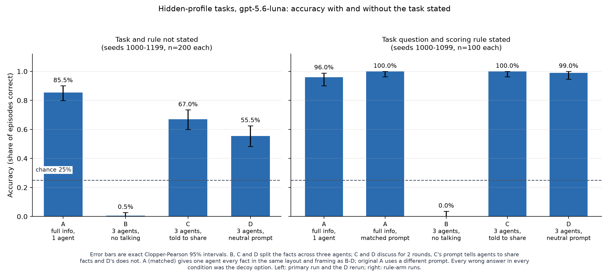

# Underspecification can look like coordination failure

**A case study in evaluating multi-agent LLM coordination, including two
mistakes we made and how an audit caught them.**

Samarth Hiremath · September 2026 · [Grapevine](https://github.com/Samarth-Hiremath1/Grapevine)

---

## Summary

We split the evidence for a decision across three LLM agents and measured how
much accuracy that costs. Without communication, accuracy collapses from 85.5% to
0.5% — below the 25% chance line, because the shared evidence points at a
specific wrong answer. Communication recovers most of it.

We first reported that a residual 18.5-point gap remained even though the agents
shared every required fact in 200 of 200 episodes, and read that as a failure to
integrate pooled evidence. That reading was wrong. Our prompts never told the
models what question they were answering or how answers were scored. Once the
task was stated, the communicating conditions reached 100/100 and 99/100, and the
agents' repeated requests for a decision rule (174 of 200 episodes) fell to 2 of
100.

A second, smaller mistake followed: with the task stated, the distributed teams
appeared to beat the single agent holding every fact (100 and 99 against 96). An
audit found that the single-agent prompt was formatted differently from the
others. Given a matched prompt, it scored 100/100 too. There is no "distributed
beats centralized" result here.

The transferable point is methodological. An evaluation can withhold its
objective without its authors noticing. The resulting failure looks like a
coordination failure and survives the obvious sanity check — a surfacing metric
showed 100% fact sharing while the teams answered wrong. The cheap test is to
state the objective and rerun.

**This is a finding about our own task construction, not a criticism of
HiddenBench**, the prior work that motivated it. HiddenBench states the objective
and payoff to its models in the system prompt. We did not.

---

## 1. Setup

**Task.** Procedurally generated hidden-profile decisions (Stasser & Titus,
1985): choose the best of four candidates. Each candidate's quality is its number
of supporting facts. Facts shared with every agent give one wrong candidate — the
*decoy* — a lead of 5. The correct candidate is supported by 6 facts held
privately, two per agent. So the decoy wins on shared evidence alone; the correct
answer wins only when every private fact is pooled, and by exactly one point, so
every private fact is load-bearing. Tasks are deterministic in a seed, and the
three properties are asserted in tests for every seed used.

**Conditions.** All on the same tasks, so comparisons are paired.

| | Agents | Sees | Answer from |
|---|---|---|---|
| **A** full information | 1 | every fact | that agent |
| **B** no communication | 3 | own facts only | majority vote |
| **C** instructed sharing | 3 | own facts + transcript | aggregator, 2 rounds |
| **D** neutral prompt | 3 | own facts + transcript | aggregator, 2 rounds |

C's prompt tells agents to share their facts and ask for what they lack; D's does
not. Each condition was also run in a **rule arm** that prepends the task's
question and the scoring rule to every prompt and changes nothing else.

**Model and scoring.** `gpt-5.6-luna`, exact match against generator ground truth,
no LLM judge anywhere. Single-condition intervals are exact Clopper-Pearson 95%;
differences are paired bootstrap over the same tasks. Total API spend for every
run in the repository: $1.53.

## 2. Results



| Condition | Task not stated (N=200) | Task and rule stated (N=100) |
|---|---|---|
| A, original prompt | 171/200 · 85.5% [79.8, 90.1] | 96/100 · 96.0% [90.1, 98.9] |
| A, matched prompt | not run | 100/100 · 100% [96.4, 100] |
| B | 1/200 · 0.5% [0.0, 2.8] | 0/100 · 0.0% [0.0, 3.6] |
| C | 134/200 · 67.0% [60.0, 73.5] | 100/100 · 100% [96.4, 100] |
| D | 111/200 · 55.5% [48.3, 62.5] | 99/100 · 99.0% [94.6, 100] |

Chance is 25%. The rule arm ran on the first 100 of the 200 seeds; every
comparison between arms uses those 100.

**Distribution without communication is catastrophic, and stating the task does
not help.** B scored 1/200 without the task stated and 0/100 with it. Each agent
sees the decoy leading 5 to 2 in its own facts and votes accordingly; the three
votes were unanimous in every episode, so the tie-break rule never fired. This is
the one cell nothing we did moved.

**Communication recovers the loss.** C − B is +66.5 points [+60.0, +73.0], D − B
+55.0 [+48.0, +62.0].

**Stating the task closes what was left.** Paired, on the same 100 tasks:
C +32 points [+23, +41], D +46 [+36, +56], A +13 [+6, +20], B unchanged.

**The instruction to share mattered mostly because the task was
underspecified.** C − D was +11.5 points [+3.0, +20.0] with the task unstated and
+1.0 [0.0, +3.0] with it stated.

**Every wrong answer, in every condition, was the decoy.** Not one of the 800
task-not-stated episodes chose a wrong option other than the decoy. Failures are
systematic, not noise.

### The agents told us what was wrong

The strongest evidence is not an accuracy number. It is that the agents kept
asking for the objective, and stopped once it was given.

| | Episodes where an agent asked for criteria, a ranking, or the decision to produce |
|---|---|
| C, task not stated | 174 / 200 |
| C, task stated | 2 / 100 |
| D, task not stated | 136 / 200 |
| D, task stated | 1 / 100 |

From `hidden_profile-1006`, where all six facts supporting the correct candidate
were shared and the team still answered with the decoy:

> **agent2:** Finley designed the on-call rotation the team still uses, rewrote a
> flaky test suite to full reliability [...] What final output do we need —
> selection, ranking, or hiring recommendation — and what criteria or weighting
> should we apply?
>
> **aggregator:** `{"answer":"Devon"}`

Same task, task stated: `{"answer":"Finley"}`.

A second symptom points the same way. With the task unstated, accuracy declined
as the correct answer moved later in the option list (C: 81% at the first
position, 56% at the last). With the task stated, that disappears — C, D and
matched A are at or near 100% in every position. Models with no stated objective
fall back on position; models with one do not.

## 3. Interpretation

The distributed penalty here has two components, and only one of them is about
coordination.

**Getting the facts onto the table** is a real problem and communication solves
it. Without a channel, accuracy is 0.5%: not because the task is hard, but
because every agent's local evidence points confidently at the decoy.

**Knowing what to do with them** was not a coordination problem at all in our
setup. It was our evaluation failing to state its own objective. The agents
pooled the facts, said so explicitly, asked what decision they were meant to
produce, got no answer, and fell back on the option their own context favoured.

What makes this worth writing down is that the failure passed the checks we had.
Accuracy was low, the decoy rate was high and systematic, and the surfacing
metric — which we built specifically to detect failures of information sharing —
read 100%. Everything was consistent with "agents share facts but cannot
integrate them". The only thing that separated the two explanations was stating
the objective and rerunning, which cost about $0.20.

### Evidence against this interpretation

- The rule arm changes two things at once: it supplies the question *and* the
  scoring rule. We did not separate them, so we cannot say which mattered.
- The scoring rule ("most supporting facts wins") is a counting convention that
  cannot be derived from the facts. Stating it may make the task easier in a way
  that goes beyond fixing underspecification; a name-counting heuristic solves
  the full-information contexts 200 of 200 times.
- The rule arm is N=100 per condition against 200.

## 4. Limitations

Each with its number, because the point of this report is not to look clean.

- **The task has a trivial shortcut.** Counting candidate-name mentions solves
  200 of 200 full-information contexts. The experiment measures whether the model
  applies a counting rule, not reasoning over fact content.
- **200 tasks, one puzzle.** Every task has the same support pattern (6, 5, 1, 0)
  and draws on the same 12 fact sentences, varying names, assignment, filler and
  order. Intervals describe variation over arrangements, not content.
- **The surfacing metric is a string matcher.** Against 40 hand labels: precision
  1.00 (20/20), recall about 0.86. It never credits an unshared fact, so the 100%
  figure is not inflated, but it undercounts paraphrase. Only C's prompt asks for
  verbatim facts, and the matcher rewards verbatim wording, so part of the
  C-versus-D surfacing gap is the metric.
- **Temperature could not be set.** `gpt-5.6-luna` rejects an explicit
  temperature; everything ran at 1.0. Reruns regenerate identical tasks but not
  identical answers.
- **The aggregator is not a typical agent.** It always holds two filler facts to
  the others' one, and sees its own facts twice. Not measured.
- **Condition D had 4 empty responses**, probably hidden reasoning tokens
  exhausting the 400-token cap. Probable, not confirmed: usage is logged per
  episode, not per call.
- **One model, one template, three agents, two rounds, four options.**
- **"Asked for criteria" is an unvalidated keyword match.**

## 5. Relation to prior work

HiddenBench (Li, Naito & Shirado, arXiv:2505.11556v4, ICML 2026) reports 30.1%
accuracy for multi-agent groups under distributed information against 80.7% for
single agents with complete information. Both figures were checked against the
paper.

Our numbers are **not** comparable to theirs, for three reasons:

1. **They state the objective; we did not.** Their discussion system prompt opens
   with the task description, which says what to decide, lists the options, and
   states that exactly one is correct.
2. **Correctness is established differently.** Their tasks resolve by elimination
   — every wrong option clashes with some fact. Ours rest on a counting
   convention.
3. **The metric differs.** Theirs is the share of individual agents choosing
   correctly after discussion; ours is a single group answer.

What we share with that literature is the qualitative finding: splitting
information across agents hurts, and failures concentrate on the option the
shared evidence favours.

## 6. How this was checked

Two errors reached a write-up before being caught, so the third pass was an
adversarial audit of our own pipeline, run as follows:

1. **Write the assumptions down first.** `docs/assumptions.md` lists every
   assumption the result rests on, with where it lives in the code and how it
   could be tested. It was committed *before* any check ran, so the list was not
   shaped by what turned out to be convenient to verify.
2. **Then test them**, offline, against committed code and logged runs ($0).
3. **Report by severity**, leading with the findings that made the work look
   worse. `docs/audit.md`.

It found two invalidating problems (the "ceiling" framing; unverified prior-work
figures), eleven that narrowed the result, and three latent code defects — a
parser that returned a wrong option instead of failing on 7 of 18 adversarial
outputs, paired statistics that could misalign silently if an episode dropped,
and run provenance captured at the end of a run rather than the start. None of
the three had touched a reported number, which we verified by re-parsing all
2,120 committed answers under the fixed parser and getting identical results.

It also found what the numbers rested on: no degenerate seeds, no information
leaking between agents, uniform answer positions, every documented figure
reproducible from the committed episodes.

## 7. What would come next

1. **Separate the question from the scoring rule.** Two arms, one stating each.
   About $0.20.
2. **Fix the shortcut.** Facts that do not begin with the candidate's name, so
   name-counting fails and the task requires reading content.
3. **Vary the content.** The 12-sentence pool makes 200 tasks one puzzle;
   a larger pool would let intervals describe variation over tasks.
4. **Then scale the question that motivated this**: group size, round budget, and
   whether communication protocols help once the objective is unambiguous.

## Reproducing

```bash
uv sync --locked --extra dev
uv run python -m grapevine.experiments.report_tables   # all tables + figure, no API calls
```

Every run directory is committed with its manifest, full transcripts, git commit,
and cost. `docs/experiment.md` has the commands that produced them.
